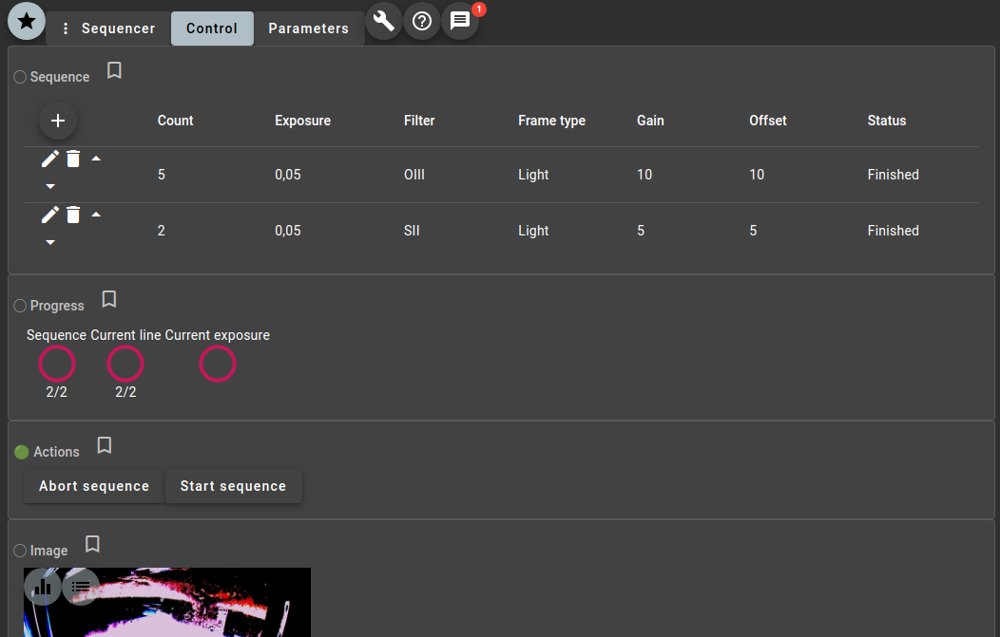

OST est un petit serveur de gestion et de contrôle à distance d'une session d'astrophotographie.

Sa conception modulaire permet de choisir et de personnaliser les fonctions que l'on souhaite piloter.

OST est et restera un projet OpenSource, utilisant d'autres composants basés sur une utilisation libre.

